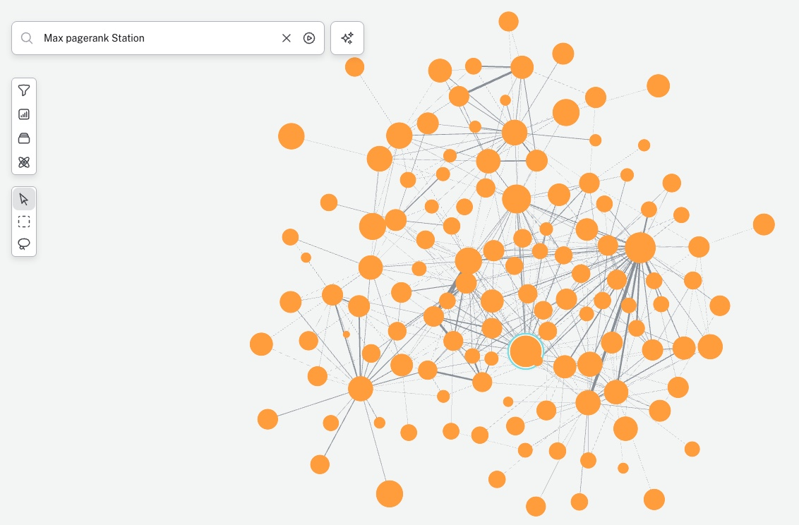

# nodes2025
NODES 2025 DEMO WITH EXPLAINED PAGERANK AND STATE MACHINES

<p align="center">
  
  
</p>


This repository is organized this way:

- **backups/** – Data to be imported thanks to the graph model in Aura.
- **bloom/** – Neo4j Bloom views, scenes, or style configurations.
- **cypher/** – Cypher queries, scripts, and procedures for database operations.
- **dashboards/** – Visual dashboard where steb-by-steb pagerank is performed
- **images/** – Supporting images and visual assets.
- **model/** – Graph model for bike trips

---

**Usage**
Clone the repository and explore each subdirectory for domain-specific assets:
```bash
git clone <repo-url>
cd <repo-name>
